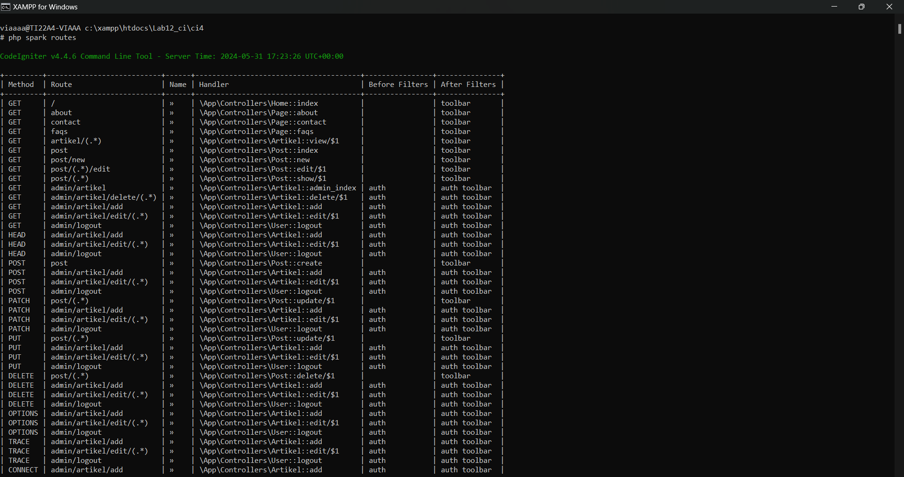

`Nama  : Faizah Via Fadhillah`

`Nim   : 312210460`

`Kelas : TI22.A4`

# Praktikum 5: Upload File Gambar

## Instruksi Praktikum

1. Persiapkan text editor misalnya VSCode.
2. Buka kembali folder dengan nama lab12_ci pada docroot webserver (htdocs)
3. Ikuti langkah-langkah praktikum yang akan dijelaskan berikutnya.

## Langkah-langkah Praktikum

### Upload Gambar pada Artikel

Menambahkan fungsi unggah gambar pada tambah artikel.

1. Buka kembali `Controller Artikel` pada project sebelumnya, sesuaikan kode pada method **add** seperti berikut:

```php
     public function add()
     {
     // validasi data.
     $validation = \Config\Services::validation();
     $validation->setRules(['judul' => 'required']);
     $isDataValid = $validation->withRequest($this->request)->run();

     if ($isDataValid)
     {
         $file = $this->request->getFile('gambar');
         $file->move(ROOTPATH . 'public/gambar');

         $artikel = new ArtikelModel();
         $artikel->insert([
             'judul' => $this->request->getPost('judul'),
             'isi' => $this->request->getPost('isi'),
             'slug' => url_title($this->request->getPost('judul')),
             'gambar' => $file->getName(),
         ]);
         return redirect('admin/artikel');
     }
     $title = "Tambah Artikel";
     return view('artikel/form_add', compact('title'));
     }
```

2. Kemudian pada file `views/artikel/form_add.php` tambahkan field input file seperti berikut.

```html
<p>
  <input type="file" name="gambar" />
</p>
```

3. Sesuaikan tag form dengan menambahkan encrypt type seperti berikut.

```html
<form action="" method="post" enctype="multipart/form-data"></form>
```

4. Ujicoba file upload dengan mengakses menu tambah artikel.


# Praktikum 6: AJAX

## Instruksi Praktikum

1. Persiapkan text editor misalnya VSCode.
2. Buka kembali folder dengan nama lab12_ci pada docroot webserver (htdocs)
3. Ikuti langkah-langkah praktikum yang akan dijelaskan berikutnya.

## Apa itu AJAX?

**AJAX** merupakan singkatan dari `Asynchronous JavaScript and XML`. Meskipun kepanjangannya menyebutkan XML, pada praktiknya AJAX tidak terbatas pada penggunaan XML saja. AJAX adalah kumpulan teknik pengembangan web yang memungkinkan aplikasi web bekerja secara `asynchronous` (tidak langsung).

Dengan kata lain, AJAX memungkinkan aplikasi web untuk memperbarui dan menampilkan data dari server tanpa harus melakukan reload halaman secara keseluruhan. Hal ini membuat aplikasi web terasa lebih responsif dan dinamis.

## Langkah-langkah Praktikum

### Menambahkan Pustaka jQuery.

Kita akan menggunakan pustaka jQuery untuk mempermudah proses AJAX. Downloadpustaka jQuery versi terbaru dari https://jquery.com dan ekstrak filenya.

Salin file jquery-3.6.0.min.js ke folder `public/assets/js`.

1. Membuat Model

Pada modul sebelumnya sudah dibuat ArtikelModel, pada modul ini kita akan memanfaatkan model tersebut agar dapat diakses melalui AJAX.

2. Membuat AJAX Controller

````php
      <?php

      namespace App\Controllers;
      use CodeIgniter\Controller;
      use CodeIgniter\HTTP\Request;
      use CodeIgniter\HTTP\Response;
      use App\Models\ArtikelModel;
      class AjaxController extends Controller
      {
      public function index()
      {
      return view('ajax/index');
      }
      public function getData()
      {
      $model = new ArtikelModel();
      $data = $model->findAll();
      // Kirim data dalam format JSON
      return $this->response->setJSON($data);
          }
          public function delete($id)
      {
      $model = new ArtikelModel();
          $data = $model->delete($id);
          $data = [
      'status' => 'OK'
      ];
      // Kirim data dalam format JSON
      return $this->response->setJSON($data);
          }
      }
    ```
3. Membuat View

```php
      <?= $this->include('template/header'); ?>

      <h1>Data Artikel</h1>

      <table class="table-data" id="artikelTable">
          <thead>
              <tr>
                  <th>ID</th>
                  <th>Judul</th>
                  <th>Status</th>
                  <th>Aksi</th>
              </tr>
          </thead>
          <tbody></tbody>
      </table>

      <script src="<?= base_url('assets/js/jquery-3.6.0.min.js') ?>"></script>
      <script>
          $(document).ready(function() {
              // Function to display a loading message while data is fetched
              function showLoadingMessage() {
                  $('#artikelTable tbody').html('<tr><td colspan="4">Loading

                      data... < /td></tr > ');
              }
              // Buat fungsi load data
              function loadData() {
                showLoadingMessage(); // Display loading message initially
                  // Lakukan request AJAX ke URL getData
                  $.ajax({
                    url: "<?= base_url('ajax/getData') ?>",
                    method: "GET",
                    dataType: "json",
                    success: function(data) {
                      // Tampilkan data yang diterima dari server
                      var tableBody = "";
                      for (var i = 0; i < data.length; i++) {
                        var row = data[i];
                          tableBody += '<tr>';
                          tableBody += '<td>' + row.id + '</td>';
                          tableBody += '<td>' + row.judul + '</td>';
                          // Add a placeholder for the "Status" column (modify

                          as needed)

                          tableBody += '<td><span class="status">---</span></td > ';

                          tableBody += '<td>';
                          // Replace with your desired actions (e.g., edit,

                          delete)

                          tableBody += '<a href="<?= base_url('artikel/edit/')

                          ?>' + row.id + '" class="btn btn-primary">Edit</a>';

                          tableBody += ' <a href="#" class="btn btn-danger btn - delete " data-id="' + row.id + '">Delete</a>';
                          tableBody += '</td>';
                          tableBody += '</tr>';
                        }
                      $('#artikelTable tbody').html(tableBody);
                    }
                  });
              }
          loadData();
          // Implement actions for buttons (e.g., delete confirmation)
          $(document).on('click', '.btn-delete', function(e) {
              e.preventDefault();
              var id = $(this).data('id');
              // Add confirmation dialog or handle deletion logic here
              // hapus data;
              if (confirm('Apakah Anda yakin ingin menghapus artikel ini?'))

              {
                  $.ajax({

                      url: "<?= base_url('artikel/delete/') ?>" + id,
                      method: "DELETE",
                      success: function(data) {
                          loadData(); // Reload Datatables to reflect changes
                      },
                      error: function(jqXHR, textStatus, errorThrown) {
                          alert('Error deleting article: ' + textStatus +

                              errorThrown);
                      }
                  });
              }
              console.log('Delete button clicked for ID:', id);
          });
          });
      </script>

      <?= $this->include('template/footer'); ?>
    ```
````

# Praktikum 7: API

## Instruksi Praktikum

1. Persiapkan text editor misalnya VSCode.
2. Buka kembali folder dengan nama lab12_ci pada docroot webserver (htdocs)
3. Ikuti langkah-langkah praktikum yang akan dijelaskan berikutnya.

## Apa itu REST API?

_Representational State Transfer_ (REST) adalah salah satu desain arsitektur _Application Programming Interface_ (API). API sendiri merupakan interface yang menjadi perantara yang menghubungkan satu aplikasi dengan aplikasi lainnya.

REST API berisi aturan untuk membuat web service dengan membatasi hak akses client yang mengakses API. Kenapa harus demikian? Jika dianalogikan sebagai restoran, REST API adalah daftar menu. Pelanggan hanya bisa memesan sesuai daftar menu meskipun si koki (server) bisa membuatkan pesanan tersebut.

REST API bisa diakses atau dihubungkan dengan aplikasi lain. Oleh sebab itu, pembatasan dilakukan untuk melindungi database/resource yang ada di server.

## Cara kerja REST API menggunakan prinsip REST Server dan REST Client

REST Server bertindak sebagai penyedia data/resource, sedangkan REST Client akan membuat HTTP request pada server dengan URI atau global ID. Nantinya, server akan memberikan response dengan mengirim kembali HTTP request yang diminta client.

Nah, data yang dikirim maupun diterima ini biasanya berformat JSON. Itulah kenapa REST API mudah diintegrasikan dengan berbagai platform dengan bahasa pemrograman ataupun framework yang berbeda. Misalnya, Kamu membuat backend project menggunakan REST API dengan bahasa pemrograman PHP. Nantinya, REST API tersebut bisa dihubungkan dengan frontend yang menggunakan Vue js.

## Langkah-langkah Praktikum

1. Membuat Model

Pada modul sebelumnya sudah dibuat `ArtikelModel`, pada modul ini kita akan memanfaatkan model tersebut agar dapat diakses melalui API.

2. Membuat REST Controller

Pada tahap ini, kita akan membuat file **REST Controller** yang berisi fungsi untuk **menampilkan**, **menambah**, **mengubah** dan **menghapus data**. Masuklah ke direktori `app\Controllers` dan buatlah file baru bernama `Post.php`. Kemudian, salin kode di bawah ini ke dalam file tersebut:

```php
       <?php

       namespace App\Controllers;

       use CodeIgniter\RESTful\ResourceController;
       use CodeIgniter\API\ResponseTrait;
       use App\Models\ArtikelModel;

       class Post extends ResourceController
       {
           use ResponseTrait;
           // all users
           public function index()
           {
               $model = new ArtikelModel();
               $data['artikel'] = $model->orderBy('id', 'DESC')->findAll();
               return $this->respond($data);
           }
           // create
           public function create()
           {
               $model = new ArtikelModel();
               $data = [
                   'judul' => $this->request->getVar('judul'),
                   'isi' => $this->request->getVar('isi'),
               ];
               $model->insert($data);
               $response = [
                   'status' => 201,
                   'error' => null,
                   'messages' => [
                       'success' => 'Data artikel berhasil ditambahkan.'
                   ]
               ];
               return $this->respondCreated($response);
           }
           // single user
           public function show($id = null)
           {
               $model = new ArtikelModel();
               $data = $model->where('id', $id)->first();
               if ($data) {
                   return $this->respond($data);
               } else {
                   return $this->failNotFound('Data tidak ditemukan.');
               }
           }
           // update
           public function update($id = null)
           {
               $model = new ArtikelModel();
               #$id = $this->request->getVar('id');
               $data = [
                   'judul' => $this->request->getVar('judul'),
                   'isi' => $this->request->getVar('isi'),
               ];
               $model->update($id, $data);
               $response = [
                   'status' => 200,
                   'error' => null,
                   'messages' => [
                       'success' => 'Data artikel berhasil diubah.'
                   ]
               ];
               return $this->respond($response);
           }
           // delete
           public function delete($id = null)
           {
               $model = new ArtikelModel();
               $data = $model->where('id', $id)->delete($id);
               if ($data) {
                   $model->delete($id);
                   $response = [
                       'status' => 200,
                       'error' => null,
                       'messages' => [
                           'success' => 'Data artikel berhasil dihapus.'
                       ]
                   ];
                   return $this->respondDeleted($response);
               } else {
                   return $this->failNotFound('Data tidak ditemukan.');
               }
           }
       }
```

Kode diatas berisi 5 method, yaitu:

- **index()** Berfungsi untuk menampilkan seluruh data pada database.
- **create()** Berfungsi untuk menambahkan data baru ke database.
- **show()** Berfungsi untuk menampilkan suatu data spesifik dari database.
- **update()** Berfungsi untuk mengubah suatu data pada database.
- **delete()** Berfungsi untuk menghapus data dari database.

3. Membuat Routing REST API

Untuk mengakses REST API CodeIgniter, kita perlu mendefinisikan route-nya terlebih dulu.

- Caranya Masuklah ke direktori `app/Config` dan bukalah file `Routes.php`. Tambahkan kode di bawah ini:

```php
     $routes->resource('post');
```

- Untuk mengecek route nya jalankan perintah berikut:

````
    php spark routes
    ```
````

- Selanjutnya akan muncul daftar route yang telah dibuat.



Seperti yang terlihat, satu baris kode routes yang di tambahkan akan menghasilkan banyak Endpoint.

4. Testing REST API CodeIgniter
   Buka aplikasi **postman** dan pilih `create new → HTTP Request`.


5. Menampilkan Semua Data

- Pilih method `GET` dan masukkan URL berikut: http://localhost:8080/post

- Lalu, klik `Send`. Jika hasil test menampilkan semua data artikel dari database, maka pengujian berhasil.


6. Menampilkan Data Spesifik

- Masih menggunakan method `GET`, hanya perlu menambahkan ID artikel di belakang URL seperti ini: http://localhost:8080/post/2

- Selanjutnya, klik `Send`. Request tersebut akan menampilkan data artikel yang memiliki ID nomor 2 di database.


7. Mengubah Data

- Untuk mengubah data, silakan ganti method menjadi `PUT`. Kemudian, masukkan URL artikel yang ingin diubah. Misalnya, ingin mengubah data artikel dengan ID nomor 4, maka masukkan URL berikut: http://localhost:8080/post/4

- Selanjutnya, pilih tab **Body**. Kemudian, pilih **x-www-form-uriencoded**. Masukkan nama atribut tabel pada kolom **KEY** dan nilai data yang baru pada kolom **VALUE**. Kalau sudah, klik `Send`.


8. Menambahkan Data

- Kamu perlu menggunakan method `POST` untuk menambahkan data baru ke database. Kemudian, masukkan URL berikut: http://localhost:8080/post

- Pilih tab **Body**, lalu pilih **x-www-form-uriencoded**. Masukkan atribut tabel pada kolom **KEY** dan nilai data baru di kolom **VALUE**. Jangan lupa, klik `Send`.


9. Menghapus Data

- Pilih method `DELETE` untuk menghapus data. Lalu, masukkan URL spesifik data mana yang ingin di hapus. Misalnya, ingin menghapus data nomor 4, maka URL-nya seperti ini: http://localhost:8080/post/4

- Langsung saja klik `Send`, maka akan mendapatkan pesan bahwa data telah berhasil dihapus dari database.


